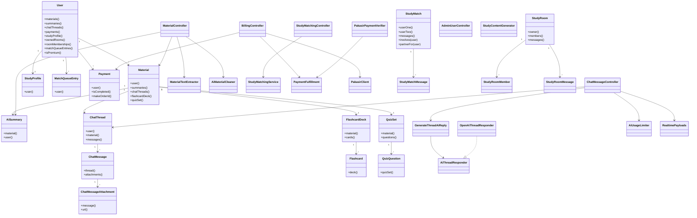
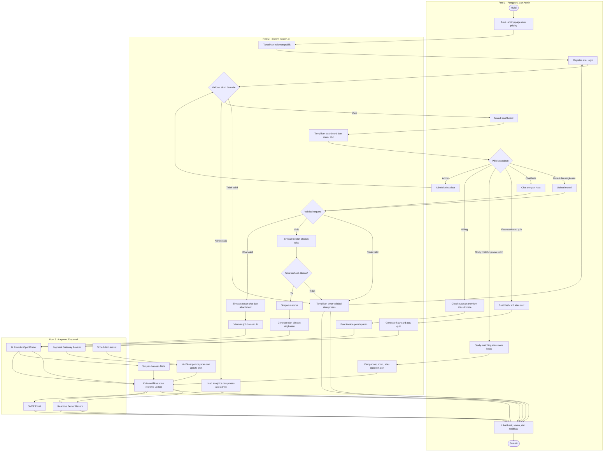

# Diagram Sistem Nalarin.ai

Dokumen ini berisi versi lengkap diagram utama untuk project Nalarin.ai. Format diagram memakai Mermaid agar bisa ditempel ke Markdown viewer, GitHub, atau draw.io yang mendukung Mermaid.

## 1. Use Case Diagram

```mermaid
graph LR
    actor_visitor["Visitor"]
    actor_user["User"]
    actor_admin["Admin"]
    actor_pakasir["Pakasir"]
    actor_ai["AI Provider"]
    actor_scheduler["Scheduler"]

    subgraph Public_Area
        UC_Landing["Melihat Landing Page"]
        UC_Pricing["Melihat Pricing"]
        UC_Register["Register"]
        UC_Login["Login"]
        UC_Forgot["Forgot Password"]
    end

    subgraph Learning_Workspace
        UC_Dashboard["Melihat Dashboard"]
        UC_Upload["Upload Materi"]
        UC_Summary["Melihat Ringkasan AI"]
        UC_Chat["Chat dengan Nala atau AI Tutor"]
        UC_ImageChat["Upload Gambar ke Chat AI"]
        UC_Flashcard["Generate dan Review Flashcard"]
        UC_Quiz["Generate dan Mengerjakan Quiz"]
        UC_Pomodoro["Pomodoro"]
        UC_Focus["Focus Planner dan Insights"]
        UC_Profile["Kelola Profil"]
        UC_Notif["Kelola Notifikasi"]
    end

    subgraph Social_Learning
        UC_Room["Membuat atau Join Room Kelas"]
        UC_RoomChat["Chat Room Kelas"]
        UC_ProfileMatch["Menyiapkan Study Profile"]
        UC_Match["Study Matching atau Roulette"]
        UC_MatchChat["Chat Partner Belajar"]
        UC_EndMatch["Stop, End, Block, atau Report Match"]
    end

    subgraph Billing_Area
        UC_Buy["Checkout Premium atau Ultimate"]
        UC_Return["Payment Return"]
        UC_Webhook["Webhook Pembayaran"]
        UC_ResetCredit["Reset Credit Ultimate Bulanan"]
    end

    subgraph Admin_Area
        UC_AdminDashboard["Dashboard Admin"]
        UC_MonitorAI["Monitoring AI"]
        UC_Stats["Statistik Pembelajaran"]
        UC_ManageUser["Kelola User dan Plan"]
        UC_ManageDocs["Kelola Dokumen"]
    end

    actor_visitor --> UC_Landing
    actor_visitor --> UC_Pricing
    actor_visitor --> UC_Register
    actor_visitor --> UC_Login
    actor_visitor --> UC_Forgot

    actor_user --> UC_Dashboard
    actor_user --> UC_Upload
    actor_user --> UC_Summary
    actor_user --> UC_Chat
    actor_user --> UC_ImageChat
    actor_user --> UC_Flashcard
    actor_user --> UC_Quiz
    actor_user --> UC_Pomodoro
    actor_user --> UC_Focus
    actor_user --> UC_Profile
    actor_user --> UC_Notif
    actor_user --> UC_Room
    actor_user --> UC_RoomChat
    actor_user --> UC_ProfileMatch
    actor_user --> UC_Match
    actor_user --> UC_MatchChat
    actor_user --> UC_EndMatch
    actor_user --> UC_Buy
    actor_user --> UC_Return

    actor_admin --> UC_AdminDashboard
    actor_admin --> UC_MonitorAI
    actor_admin --> UC_Stats
    actor_admin --> UC_ManageUser
    actor_admin --> UC_ManageDocs

    actor_pakasir --> UC_Webhook
    actor_ai --> UC_Summary
    actor_ai --> UC_Chat
    actor_ai --> UC_Flashcard
    actor_ai --> UC_Quiz
    actor_scheduler --> UC_ResetCredit
```

## 2. ERD

## 3. Class Diagram

## 4. Activity Diagram Sederhana - 3 Pool Utama

Diagram ini menyederhanakan activity diagram utama menjadi tiga pool vertikal yang sejajar. Detail teknis seperti controller, tabel, queue, dan service tetap direpresentasikan di dalam pool **Sistem Nalarin.ai** agar alurnya tidak berubah makna.

## 5. Catatan Implementasi Diagram

- Untuk laporan akademik, gunakan **Use Case Diagram** untuk menjelaskan fitur dari sisi aktor.
- Gunakan **Activity Diagram Sederhana - 3 Pool Utama** jika laporan membutuhkan gambaran alur end-to-end yang ringkas.
- Jika butuh detail teknis lebih dalam, pecah lagi activity diagram berdasarkan fitur: upload materi, chat AI, study matching, billing, dan admin.
- Gunakan **ERD** untuk menjelaskan struktur database MySQL.
- Gunakan **Class Diagram** untuk menjelaskan arsitektur Laravel: Controller, Model, Service, Job, Event, dan Support class.
- Diagram di atas mengikuti struktur project saat ini: Laravel, MySQL, OpenRouter/AI provider, Pakasir payment, queue job, dan realtime event.
