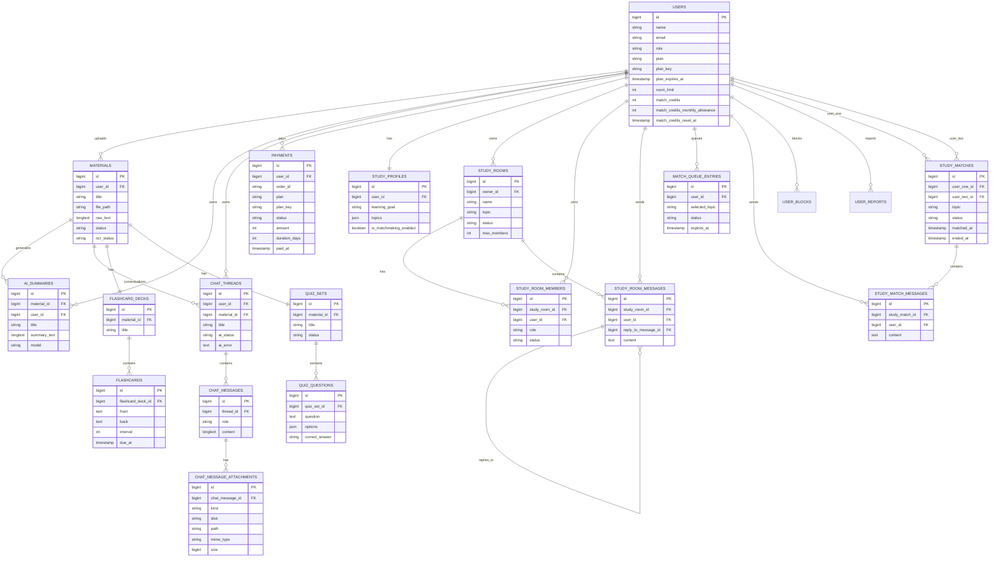
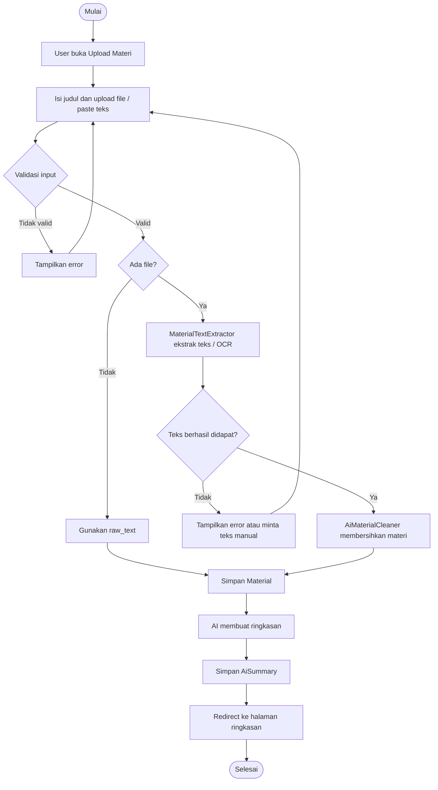
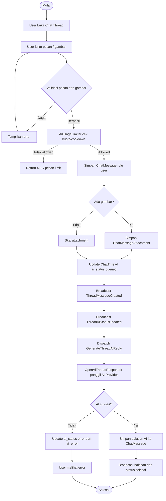
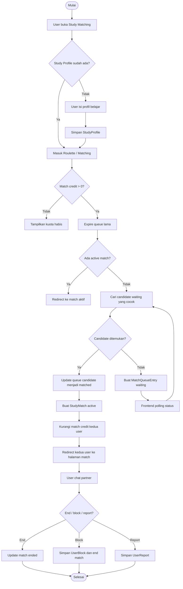
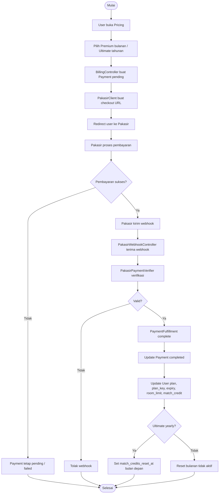
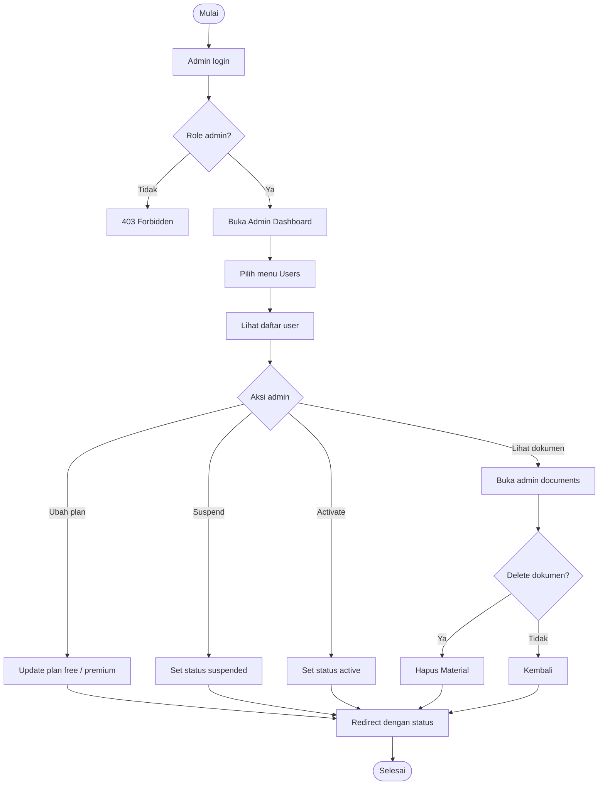

# Diagram Sistem Nalarin.ai

Dokumen ini berisi versi lengkap diagram utama untuk project Nalarin.ai. Format diagram memakai Mermaid agar bisa ditempel ke Markdown viewer, GitHub, atau draw.io yang mendukung Mermaid.

## 1. Use Case Diagram

```mermaid
flowchart LR
    Visitor([Visitor])
    User([User])
    Admin([Admin])
    Pakasir([Pakasir])
    AI([AI Provider / OpenRouter])
    Scheduler([Scheduler])

    subgraph Public["Public Area"]
        UC_Landing([Melihat Landing Page])
        UC_Pricing([Melihat Pricing])
        UC_Register([Register])
        UC_Login([Login])
        UC_Forgot([Forgot Password])
    end

    subgraph Learning["Learning Workspace"]
        UC_Dashboard([Melihat Dashboard])
        UC_Upload([Upload Materi])
        UC_Summary([Melihat Ringkasan AI])
        UC_Chat([Chat dengan Nala / AI Tutor])
        UC_ImageChat([Upload Gambar ke Chat AI])
        UC_Flashcard([Generate dan Review Flashcard])
        UC_Quiz([Generate dan Mengerjakan Quiz])
        UC_Pomodoro([Pomodoro])
        UC_Focus([Focus Planner dan Insights])
        UC_Profile([Kelola Profil])
        UC_Notif([Kelola Notifikasi])
    end

    subgraph Social["Social Learning"]
        UC_Room([Membuat / Join Room Kelas])
        UC_RoomChat([Chat Room Kelas])
        UC_ProfileMatch([Menyiapkan Study Profile])
        UC_Match([Study Matching / Roulette])
        UC_MatchChat([Chat Partner Belajar])
        UC_EndMatch([Stop / End / Block / Report Match])
    end

    subgraph Billing["Billing"]
        UC_Buy([Checkout Premium / Ultimate])
        UC_Return([Payment Return])
        UC_Webhook([Webhook Pembayaran])
        UC_ResetCredit([Reset Credit Ultimate Bulanan])
    end

    subgraph AdminArea["Admin Area"]
        UC_AdminDashboard([Dashboard Admin])
        UC_MonitorAI([Monitoring AI])
        UC_Stats([Statistik Pembelajaran])
        UC_ManageUser([Kelola User dan Plan])
        UC_ManageDocs([Kelola Dokumen])
    end

    Visitor --> UC_Landing
    Visitor --> UC_Pricing
    Visitor --> UC_Register
    Visitor --> UC_Login
    Visitor --> UC_Forgot

    User --> UC_Dashboard
    User --> UC_Upload
    User --> UC_Summary
    User --> UC_Chat
    User --> UC_ImageChat
    User --> UC_Flashcard
    User --> UC_Quiz
    User --> UC_Pomodoro
    User --> UC_Focus
    User --> UC_Profile
    User --> UC_Notif
    User --> UC_Room
    User --> UC_RoomChat
    User --> UC_ProfileMatch
    User --> UC_Match
    User --> UC_MatchChat
    User --> UC_EndMatch
    User --> UC_Buy
    User --> UC_Return

    Admin --> UC_AdminDashboard
    Admin --> UC_MonitorAI
    Admin --> UC_Stats
    Admin --> UC_ManageUser
    Admin --> UC_ManageDocs

    Pakasir --> UC_Webhook
    AI --> UC_Summary
    AI --> UC_Chat
    AI --> UC_Flashcard
    AI --> UC_Quiz
    Scheduler --> UC_ResetCredit
```

## 2. ERD

## 3. Class Diagram

## 4. Activity Diagram - Upload Materi dan Ringkasan

## 5. Activity Diagram - Chat AI / Nala

## 6. Activity Diagram - Study Matching / Roulette

## 7. Activity Diagram - Billing Premium / Ultimate

## 8. Activity Diagram - Admin Kelola User

## 9. Catatan Implementasi Diagram

- Untuk laporan akademik, gunakan **Use Case Diagram** untuk menjelaskan fitur dari sisi aktor.
- Gunakan **Activity Diagram** per proses utama, bukan satu diagram besar.
- Gunakan **ERD** untuk menjelaskan struktur database MySQL.
- Gunakan **Class Diagram** untuk menjelaskan arsitektur Laravel: Controller, Model, Service, Job, Event, dan Support class.
- Diagram di atas mengikuti struktur project saat ini: Laravel, MySQL, OpenRouter/AI provider, Pakasir payment, queue job, dan realtime event.
